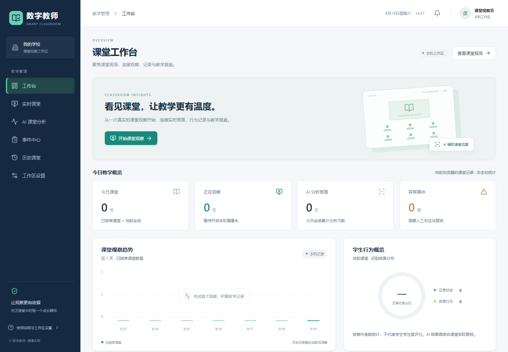
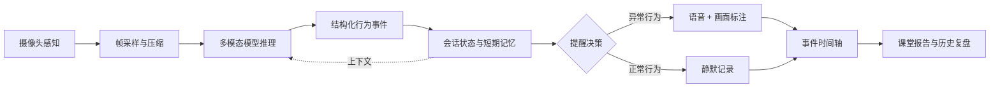
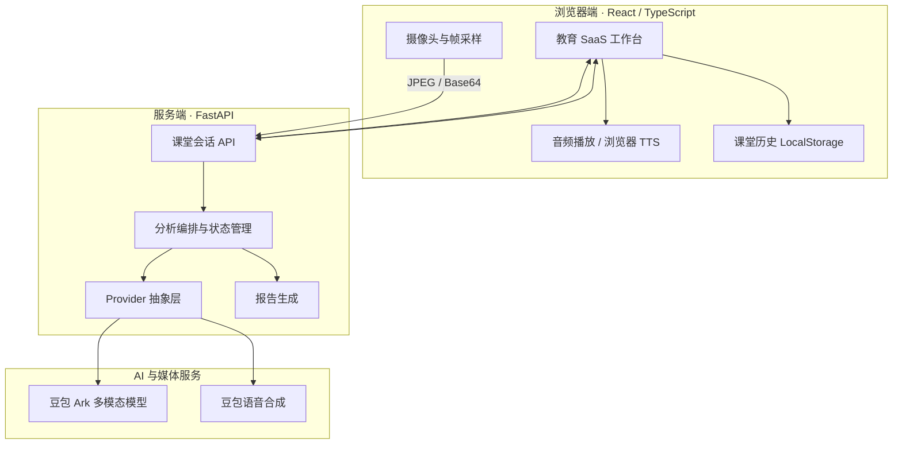

<div align="center">


# AI Digital Teacher Agent

### 多模态课堂观察智能体

**让浏览器摄像头成为课堂感知入口，持续完成观察、推理、记忆、决策、干预与复盘。**

<p>
  <a href="https://asepochs.github.io/ai-digital-teacher/"><strong>▶ 在线体验：直接打开 AI 数字教师系统</strong></a>
</p>

<p>无需注册 · 无需安装 · 支持电脑与手机摄像头</p>

[](https://asepochs.github.io/ai-digital-teacher/)
[](https://github.com/ASEpochs/ai-digital-teacher/actions/workflows/pages.yml)
[](https://react.dev/)
[](https://fastapi.tiangolo.com/)
[](https://www.typescriptlang.org/)
[](https://ai-digital-teacher-api.onrender.com/api/health)

<p>
  <a href="./README.md">中文</a>
  ·
  <a href="./README_EN.md">English</a>
  ·
  <a href="./docs/AGENT_ARCHITECTURE.md">Agent 架构设计</a>
  ·
  <a href="./docs/UI_REDESIGN.md">UI/UX 设计说明</a>
</p>

</div>

---

> **首次使用建议：** 打开[在线系统](https://asepochs.github.io/ai-digital-teacher/)，进入“实时课堂”上传一张非敏感人物照片作为监督员形象，允许摄像头访问后开始观察；系统会持续展示识别框、行为事件和异常语音提醒。结束课堂后可在“AI 课堂分析”查看逐人报告。Render 免费后端首次唤醒可能需要约一分钟。



## ✨ 项目简介

AI Digital Teacher Agent 是一个面向智慧课堂场景的多模态观察与辅助分析系统。它通过摄像头周期性获取课堂画面，调用豆包视觉模型理解学生状态，并维护一段课堂会话中的学生位置、行为变化和提醒记录。

当检测到进食、使用手机、趴桌等需要关注的行为时，Agent 会给出可解释的识别结果并触发语音提醒；正常学习状态只记录、不打扰。课堂结束后，系统会把过程事件整理为可回看的结构化报告。

这不是一次模型调用包装成的 Demo，而是一个持续运行的垂直 Agent 工作流：

- 能感知：获取并压缩实时摄像头画面；
- 能推理：把视觉内容转换成结构化课堂事件；
- 有记忆：跨帧维护座位、行为持续时间和提醒历史；
- 会决策：区分正常与异常，合并重复事件，控制提醒时机；
- 可行动：执行画面标注、语音提醒、时间轴记录和报告生成；
- 可降级：云端语音不可用时回退到浏览器原生语音。

## 🎯 一眼看懂项目

| 维度 | 当前实现 |
| --- | --- |
| 产品 | 面向学校管理人员、教学督导和教师的课堂观察工作台 |
| Agent | 感知、推理、短期记忆、提醒策略、工具行动、课后复盘完整闭环 |
| 模型 | 豆包 Seed 多模态模型，经 Ark Responses API 分析摄像头帧 |
| 状态 | 基于座位位置保持跨帧连续性，合并相同行为并追踪持续时间 |
| 干预 | 正常状态静默记录；新异常事件进入 TTS 队列，避免连续重复提醒 |
| 多端 | 手机后置摄像头、电脑摄像头、移动端音频解锁与响应式界面 |
| 工程验证 | 20 项前端测试、21 项后端测试、生产构建与 GitHub Pages CI |
| 部署 | GitHub Pages 静态前端 + Render FastAPI 服务，密钥仅保留在后端 |

## 🧠 Agent 工作闭环



| Agent 模块 | 当前实现 |
| --- | --- |
| 感知 Perception | Web Camera API 获取前置/后置摄像头画面，约每 3 秒采样并压缩 |
| 推理 Reasoning | 豆包 Seed 多模态模型识别学生位置、行为、严重程度和建议话术 |
| 记忆 Memory | `LiveSessionState` 维护稳定座位编号、行为持续时间与会话历史 |
| 决策 Policy | 正常行为不播报；异常行为触发提醒；连续相同行为合并并避免重复打扰 |
| 行动 Action | 检测框、事件流、TTS 语音提醒、课堂结束报告 |
| 工具 Tools | Ark Responses API、豆包 TTS、浏览器 Speech Synthesis、可插拔媒体服务 |

更完整的状态流、接口契约和设计取舍见 [Agent 架构设计](./docs/AGENT_ARCHITECTURE.md)。

## 🧩 核心产品能力

### 实时课堂

- 电脑默认使用前置摄像头，移动端优先使用后置摄像头；
- 实时展示学生检测框、座位标识、行为标签和风险级别；
- 支持暂停、继续、结束课堂与生成报告；
- 针对移动端浏览器完成音频解锁，异常事件可正常语音播报。

### AI 行为理解

- 支持专注学习、举手互动、使用手机、趴桌、进食、离座等课堂状态；
- 模型输出经过后端结构化校验和标准化，降低前端对模型原始文本的依赖；
- 基于座位位置做跨帧身份连续性，不使用人脸识别。

### 异常提醒与事件管理

- 只对需要关注的异常行为播报，正常学习不打扰；
- 连续相同行为合并为一个事件，记录开始时间、结束时间和持续时长；
- 同一行为恢复后再次发生时可以重新提醒；
- 支持按正常/异常筛选，并按行为名称或座位标签检索课堂记录。

### 数据驾驶舱与课后复盘

- 工作台展示当前课堂状态、正常记录占比、异常数量和最近课堂；
- AI 分析页展示行为分布、正常记录占比和学生状态；
- 课堂结束后生成学生维度的行为摘要和提醒记录；
- 最近 30 份课堂报告保存在浏览器本地，刷新页面后仍可回看。

## 🏗️ 系统架构



安全边界上，浏览器只访问项目后端，不接触 `ARK_API_KEY` 等服务端密钥。GitHub Pages 承载静态前端，Render 承载 FastAPI 服务。

## 🖥️ 页面信息架构

| 页面 | 解决的问题 |
| --- | --- |
| 工作台 | 快速判断系统状态、当前会话、正常记录占比和近期异常 |
| 实时课堂 | 启动摄像头监督，查看 AI 识别、提醒和事件时间轴 |
| AI 课堂分析 | 查看行为分布、正常记录占比和学生维度分析 |
| 异常事件 | 集中筛选和复盘需要关注的课堂行为 |
| 历史课堂 | 回看已结束课堂的报告与事件明细 |
| 系统设置 | 检查后端、视觉模型、语音能力和运行配置 |

## ⚙️ 设计与实现要点

项目覆盖了从产品定义到线上部署的完整链路：

- 产品设计：把原始摄像头识别 Demo 重构为面向学校管理、教学督导和教师的工作台；
- Agent 设计：定义“感知—推理—记忆—决策—行动—复盘”闭环和结构化输出协议；
- 全栈实现：完成 React 前端、FastAPI 后端、Provider 抽象与课堂会话 API；
- 状态工程：实现基于座位的跨帧连续性、事件合并、恢复判定和防重复提醒；
- 多端适配：处理手机后置摄像头选择、iOS/Android 音频播放限制和响应式布局；
- 安全与韧性：密钥仅保留在服务端，并为视觉分析与语音服务设计显式降级路径；
- 质量保障：前后端自动化测试、生产构建检查、GitHub Actions 与 Render 持续部署。

## 🛠️ 技术栈

| 层级 | 技术 |
| --- | --- |
| Web | React 19、TypeScript、Vite、Lucide React |
| API | Python 3.11、FastAPI、Pydantic、HTTPX |
| AI | 豆包 Seed 多模态模型、Ark Responses API |
| Voice | 豆包 TTS、Web Speech API fallback |
| State | 服务端内存会话状态、浏览器 LocalStorage |
| Test | Vitest、Testing Library、Pytest |
| Deploy | GitHub Pages、GitHub Actions、Render Blueprint |

## 🚀 在线体验路线

### 路线 A：观察完整 Agent 闭环

1. 打开[线上系统](https://asepochs.github.io/ai-digital-teacher/)，进入“实时课堂”；
2. 上传一张非敏感人物照片作为监督员形象；
3. 允许摄像头访问并开始观察；
4. 查看画面采样、结构化识别、事件合并和异常语音提醒；
5. 结束课堂，在“AI 课堂分析”查看逐人报告与事件时间轴。

### 路线 B：验证移动端适配

1. 使用手机打开在线系统，授权后置摄像头和音频播放；
2. 在实时课堂切换前后镜头；
3. 触发一条测试语音或等待异常事件，检查移动端声音与手动播放降级按钮。

### 路线 C：检查数据口径

1. 完成一段包含正常与异常状态的课堂观察；
2. 对照“事件中心”与“AI 课堂分析”的事件数量；
3. 进入“历史课堂”刷新页面，验证本机报告保留与 JSON 导出。

> Render 免费实例空闲后可能休眠。首次请求若较慢，请等待约一分钟并重试。线上体验会调用真实多模态模型，请勿上传敏感或未经授权的影像。

## 🧭 关键代码导航

| 模块 | 代码入口 |
| --- | --- |
| 实时课堂状态与 Agent 行动队列 | [`frontend/src/hooks/useClassroom.ts`](frontend/src/hooks/useClassroom.ts) |
| 前后摄像头请求与降级 | [`frontend/src/camera.ts`](frontend/src/camera.ts) |
| 移动端音频解锁与播放 | [`frontend/src/mobileAudio.ts`](frontend/src/mobileAudio.ts) |
| FastAPI 路由与 Provider 装配 | [`backend/app/main.py`](backend/app/main.py) |
| 豆包多模态推理与结构化校验 | [`backend/app/services/classroom_analysis.py`](backend/app/services/classroom_analysis.py) |
| 跨帧座位记忆与事件合并 | [`backend/app/services/live_sessions.py`](backend/app/services/live_sessions.py) |
| 确定性课堂报告 | [`backend/app/services/reports.py`](backend/app/services/reports.py) |
| GitHub Pages 持续部署 | [`.github/workflows/pages.yml`](.github/workflows/pages.yml) |

## 💻 本地运行

环境要求：Node.js 20+、Python 3.11+。

```bash
git clone https://github.com/ASEpochs/ai-digital-teacher.git
cd ai-digital-teacher
python -m venv .venv
```

Windows PowerShell：

```powershell
.\.venv\Scripts\Activate.ps1
pip install -r backend/requirements.txt
Copy-Item .env.example .env
npm install
npm --prefix frontend install
npm run dev
```

macOS / Linux：

```bash
source .venv/bin/activate
pip install -r backend/requirements.txt
cp .env.example .env
npm install
npm --prefix frontend install
npm run dev
```

启动后访问：

- 前端：<http://localhost:5173>
- 后端：<http://127.0.0.1:8000>
- API 文档：<http://127.0.0.1:8000/docs>

### 必要配置

在项目根目录的 `.env` 中至少配置：

```env
CLASSROOM_ANALYSIS_PROVIDER=doubao
ARK_API_KEY=your_server_side_api_key
ARK_VIDEO_MODEL=doubao-seed-2-0-lite-260215
FRONTEND_ORIGIN=http://localhost:5173
```

可选语音配置：

```env
TTS_PROVIDER=doubao
DOUBAO_TTS_APP_ID=your_app_id
DOUBAO_TTS_ACCESS_TOKEN=your_access_token
DOUBAO_TTS_CLUSTER=volcano_tts
DOUBAO_TTS_VOICE=your_voice_type
```

未配置豆包 TTS 时，系统会回退到浏览器 Speech Synthesis。完整变量参考 [.env.example](./.env.example)。

## 🔌 API 概览

| 方法 | 路径 | 作用 |
| --- | --- | --- |
| `POST` | `/api/live-sessions` | 创建实时课堂会话 |
| `POST` | `/api/live-sessions/{id}/frames` | 分析单帧并返回结构化事件 |
| `POST` | `/api/live-sessions/{id}/finish` | 结束课堂并生成报告 |
| `POST` | `/api/tts` | 生成提醒语音或返回浏览器语音降级指令 |
| `POST` | `/api/teacher` | 上传并创建数字课堂监督员形象 |
| `GET` | `/api/health` | 查询后端及当前 Provider 状态 |

## ✅ 测试与构建

```bash
npm test
npm run build
```

GitHub Pages 工作流会在部署前执行前端测试和生产构建；Render 根据 [render.yaml](./render.yaml) 构建后端。

## 📁 项目结构

```text
.
├─ frontend/
│  └─ src/                  # React 前端与教育管理工作台
├─ backend/
│  ├─ app/
│  │  ├─ main.py            # FastAPI 路由与 Provider 装配
│  │  ├─ models.py          # API 与事件数据模型
│  │  └─ services/          # 视觉、语音、会话状态与报告逻辑
│  └─ tests/                # 后端测试
├─ docs/
│  ├─ AGENT_ARCHITECTURE.md # Agent 状态流与设计取舍
│  └─ UI_REDESIGN.md        # UI/UX 重构说明
├─ .github/workflows/       # GitHub Pages CI/CD
└─ render.yaml              # Render Blueprint
```

## 🛡️ 当前边界与负责任使用

- 这是可运行的工程原型，不是用于自动处分学生的生产级决策系统；
- 视觉模型可能误判，识别结果应由教师或督导人员复核；
- 系统不做人脸识别，也不根据画面推断姓名、身份或敏感属性；
- 当前会话状态保存在单个后端实例内，历史报告保存在当前浏览器，不支持账号、多设备同步和长期数据库存储；
- 在真实课堂采集影像前，应取得必要授权，并遵守学校制度与当地隐私法规。

## 🗺️ 下一步

- 引入 PostgreSQL、对象存储和学校/班级/角色权限模型；
- 增加人工反馈闭环与可量化评测集，持续评估误报和漏报；
- 使用 WebSocket / WebRTC 提升实时性，并支持多教室并发；
- 将规则策略升级为可配置的课堂干预策略；
- 增加可观测性、审计日志和隐私脱敏能力。

## 📚 文档

- [English README](./README_EN.md)
- [Agent 架构设计](./docs/AGENT_ARCHITECTURE.md)
- [UI/UX 重构说明](./docs/UI_REDESIGN.md)

---

**Author:** [ASEpochs](https://github.com/ASEpochs)

**Repository:** [github.com/ASEpochs/ai-digital-teacher](https://github.com/ASEpochs/ai-digital-teacher)

**Live Demo:** [asepochs.github.io/ai-digital-teacher](https://asepochs.github.io/ai-digital-teacher/)

如果这个项目对你理解多模态 Agent 工程有所帮助，欢迎 Star 或提出 Issue。
