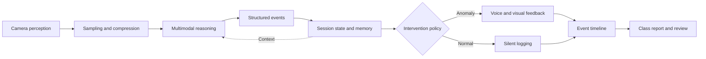
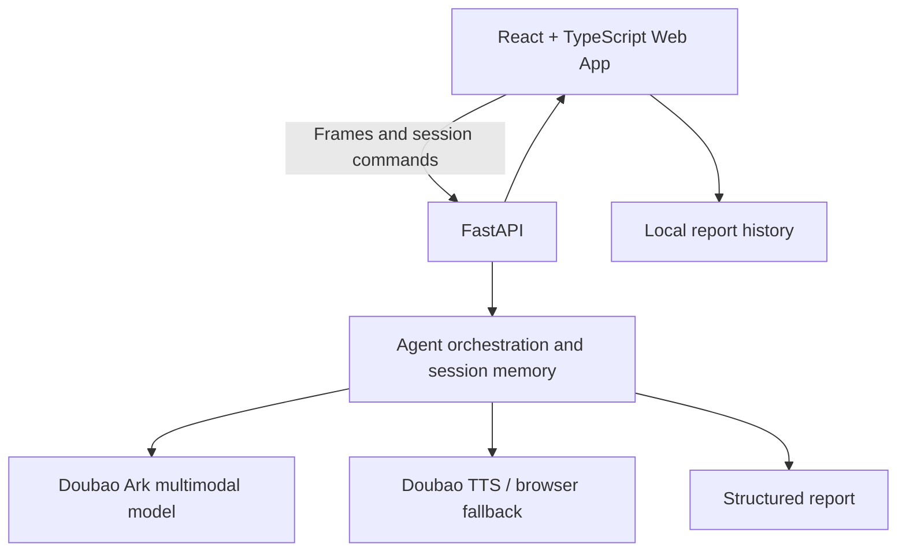

<div align="center">


# AI Digital Teacher Agent

### A multimodal Agent for classroom observation

**From camera perception and visual reasoning to memory, intervention, and post-class review.**

<p>
  <a href="https://asepochs.github.io/ai-digital-teacher/"><strong>▶ Try the live system</strong></a>
</p>

<p>No account · No installation · Desktop and mobile cameras supported</p>

[](https://asepochs.github.io/ai-digital-teacher/)
[](https://github.com/ASEpochs/ai-digital-teacher/actions/workflows/pages.yml)
[](https://react.dev/)
[](https://fastapi.tiangolo.com/)
[](https://www.typescriptlang.org/)
[](https://ai-digital-teacher-api.onrender.com/api/health)

<p>
  <a href="./README.md">中文</a>
  ·
  <a href="./README_EN.md">English</a>
  ·
  <a href="./docs/AGENT_ARCHITECTURE.md">Agent Architecture</a>
  ·
  <a href="./docs/UI_REDESIGN.md">UI/UX Notes</a>
</p>

</div>

---

> **First-time use:** open the [live system](https://asepochs.github.io/ai-digital-teacher/), enter Live Classroom, upload a non-sensitive portrait as the supervisor avatar, and grant camera access. The system will continuously display annotations, behavior events, and anomaly voice reminders. Finish the session to review the per-student report in AI Analysis. The free Render API may take about one minute to wake up.


## ✨ Why this project

Classroom behavior understanding is not a single-image classification problem. A useful system must continuously observe a lesson, preserve context across frames, distinguish normal states from actionable anomalies, avoid repetitive interruptions, and turn the session into an auditable report.

This project implements that workflow as a vertical AI Agent:

- **Perception:** captures and compresses camera frames in the browser;
- **Reasoning:** uses a Doubao Seed multimodal model to produce structured classroom events;
- **Memory:** maintains stable seat identifiers, behavior duration, and reminder history;
- **Policy:** separates normal and anomalous behavior, merges repeated observations, and controls reminder timing;
- **Action:** renders annotations, speaks reminders, records a timeline, and generates a session report;
- **Resilience:** falls back to the browser Speech Synthesis API when cloud TTS is unavailable.

## 🎯 At a glance

| Dimension | Current implementation |
| --- | --- |
| Product | A classroom observation workspace for school administrators, supervisors, and teachers |
| Agent | Continuous perception, reasoning, short-term memory, policy, action, and review |
| Model | Doubao Seed multimodal model through the Ark Responses API |
| State | Position-based cross-frame continuity, event merging, and duration tracking |
| Intervention | Normal states are logged silently; new anomalies enter a deduplicated TTS queue |
| Devices | Rear mobile camera, desktop webcams, mobile audio unlocking, responsive UI |
| Verification | 20 frontend tests, 21 backend tests, production build, and GitHub Pages CI |
| Deployment | GitHub Pages frontend + Render FastAPI backend; credentials remain server-side |

## 🧠 Agent loop



## 🧩 Highlights

- Real-time classroom observation with front/rear camera selection;
- Structured student behavior, normalized bounding boxes, and severity;
- Position-based continuity across frames without face recognition;
- Event merging, recovery detection, and reminder deduplication;
- Mobile audio unlocking for anomaly reminders on iOS and Android;
- Dashboard, live classroom, analysis, anomaly, history, and settings views;
- Provider abstraction for vision, TTS, media storage, and optional media generation;
- Server-side secret isolation, explicit service status, and graceful fallbacks;
- Automated frontend/backend tests and continuous deployment.

## 🏗️ Architecture



The static frontend is deployed on GitHub Pages, while the FastAPI service runs on Render. AI credentials remain on the server and are never exposed to the browser.

## ⚙️ Implementation highlights

The project covers the complete path from product definition to online deployment:

- Product definition and information architecture for school administrators, supervisors, and teachers;
- Agent loop, structured model contract, session state, event merging, and reminder policy;
- React frontend, FastAPI backend, provider abstractions, and API design;
- Responsive education SaaS interface and mobile camera/audio compatibility;
- Testing, production build, GitHub Pages CI/CD, and Render deployment.

## 🛠️ Tech stack

| Layer | Technology |
| --- | --- |
| Web | React 19, TypeScript, Vite, Lucide React |
| API | Python 3.11, FastAPI, Pydantic, HTTPX |
| AI | Doubao Seed multimodal model, Ark Responses API |
| Voice | Doubao TTS, Web Speech API fallback |
| Test | Vitest, Testing Library, Pytest |
| Deploy | GitHub Pages, GitHub Actions, Render |

## 🚀 Suggested demo paths

### A. Show the full Agent loop

1. Open the [live system](https://asepochs.github.io/ai-digital-teacher/) and enter Live Classroom.
2. Upload a non-sensitive portrait and grant camera access.
3. Inspect frame analysis, structured events, continuity, and anomaly voice reminders.
4. Finish the class and open AI Analysis to review the report and timeline.

### B. Verify mobile behavior

1. Open the site on a phone and grant rear-camera and audio permissions.
2. Switch between front and rear cameras.
3. Test a voice reminder and inspect the explicit playback fallback if autoplay is blocked.

### C. Inspect reporting semantics

1. Complete a session containing both normal and anomalous observations.
2. Compare Event Center counts with AI Analysis.
3. Refresh History to verify local persistence and JSON export.

> The live demo invokes a real multimodal model. Do not submit sensitive footage or images you are not authorized to process.

## 🧭 Key code

| Concern | Entry point |
| --- | --- |
| Live session state and Agent action queue | [`frontend/src/hooks/useClassroom.ts`](frontend/src/hooks/useClassroom.ts) |
| Camera selection and fallback | [`frontend/src/camera.ts`](frontend/src/camera.ts) |
| Mobile audio unlocking | [`frontend/src/mobileAudio.ts`](frontend/src/mobileAudio.ts) |
| FastAPI routes and Provider wiring | [`backend/app/main.py`](backend/app/main.py) |
| Multimodal reasoning and validation | [`backend/app/services/classroom_analysis.py`](backend/app/services/classroom_analysis.py) |
| Cross-frame memory and event merging | [`backend/app/services/live_sessions.py`](backend/app/services/live_sessions.py) |
| Deterministic report generation | [`backend/app/services/reports.py`](backend/app/services/reports.py) |
| GitHub Pages deployment | [`.github/workflows/pages.yml`](.github/workflows/pages.yml) |

## 💻 Run locally

Requirements: Node.js 20+ and Python 3.11+.

```bash
git clone https://github.com/ASEpochs/ai-digital-teacher.git
cd ai-digital-teacher
python -m venv .venv
# Activate the virtual environment, then:
pip install -r backend/requirements.txt
npm install
npm --prefix frontend install
npm run dev
```

Create a root `.env` file from `.env.example` and configure at least:

```env
CLASSROOM_ANALYSIS_PROVIDER=doubao
ARK_API_KEY=your_server_side_api_key
ARK_VIDEO_MODEL=doubao-seed-2-0-lite-260215
FRONTEND_ORIGIN=http://localhost:5173
```

Frontend: <http://localhost:5173> · API: <http://127.0.0.1:8000> · OpenAPI: <http://127.0.0.1:8000/docs>

## ✅ Verification

```bash
npm test
npm run build
```

## 🛡️ Responsible-use boundaries

- This is a working engineering prototype, not a production system for automated disciplinary decisions.
- Multimodal model outputs can be wrong and must remain subject to human review.
- The system does not perform face recognition or infer names, identities, or sensitive attributes.
- Session state currently lives in one backend instance, and recent reports are stored in the local browser.
- Real classroom use requires appropriate consent and compliance with school policy and local privacy law.

## 📚 Documentation

- [Chinese README](./README.md)
- [Agent architecture and runtime decisions](./docs/AGENT_ARCHITECTURE.md)
- [UI/UX redesign notes](./docs/UI_REDESIGN.md)

---

**Author:** [ASEpochs](https://github.com/ASEpochs)

**Live demo:** [asepochs.github.io/ai-digital-teacher](https://asepochs.github.io/ai-digital-teacher/)

If this project helps you think about multimodal Agent engineering, consider starring the repository or opening an issue.
