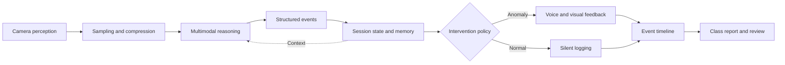
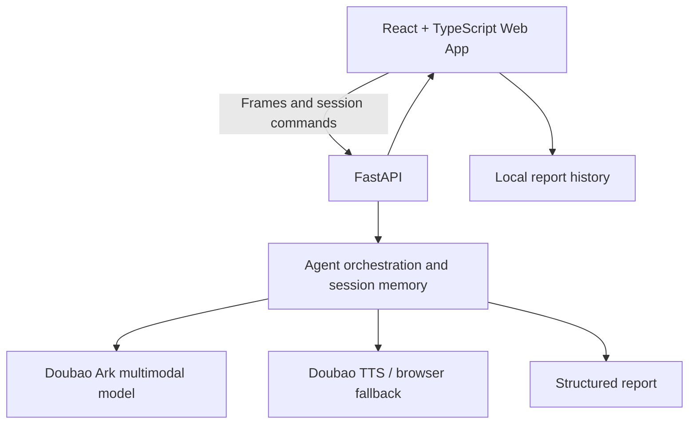

# AI Digital Teacher Agent

> A multimodal classroom observation Agent independently designed and implemented by [ASEpochs](https://github.com/ASEpochs). It turns a browser camera into a continuous perception channel and closes the loop from visual reasoning and short-term memory to intervention and post-class review.

## [▶ Try the live system](https://asepochs.github.io/ai-digital-teacher/)

No installation is required. Desktop and mobile cameras are supported. Chrome, Edge, or Safari is recommended.

[中文说明](./README.md) · [Agent Architecture](./docs/AGENT_ARCHITECTURE.md) · [UI/UX Notes](./docs/UI_REDESIGN.md)

## Why this project

Classroom behavior understanding is not a single-image classification problem. A useful system must continuously observe a lesson, preserve context across frames, distinguish normal states from actionable anomalies, avoid repetitive interruptions, and turn the session into an auditable report.

This project implements that workflow as a vertical AI Agent:

- **Perception:** captures and compresses camera frames in the browser;
- **Reasoning:** uses a Doubao Seed multimodal model to produce structured classroom events;
- **Memory:** maintains stable seat identifiers, behavior duration, and reminder history;
- **Policy:** separates normal and anomalous behavior, merges repeated observations, and controls reminder timing;
- **Action:** renders annotations, speaks reminders, records a timeline, and generates a session report;
- **Resilience:** falls back to the browser Speech Synthesis API when cloud TTS is unavailable.

## Agent loop



## Highlights

- Real-time classroom observation with front/rear camera selection;
- Structured student behavior, normalized bounding boxes, and severity;
- Position-based continuity across frames without face recognition;
- Event merging, recovery detection, and reminder deduplication;
- Mobile audio unlocking for anomaly reminders on iOS and Android;
- Dashboard, live classroom, analysis, anomaly, history, and settings views;
- Provider abstraction for vision, TTS, media storage, and optional media generation;
- Server-side secret isolation, explicit service status, and graceful fallbacks;
- Automated frontend/backend tests and continuous deployment.

## Architecture



The static frontend is deployed on GitHub Pages, while the FastAPI service runs on Render. AI credentials remain on the server and are never exposed to the browser.

## My contribution

This is a personal end-to-end project by ASEpochs:

- Product definition and information architecture for school administrators, supervisors, and teachers;
- Agent loop, structured model contract, session state, event merging, and reminder policy;
- React frontend, FastAPI backend, provider abstractions, and API design;
- Responsive education SaaS interface and mobile camera/audio compatibility;
- Testing, production build, GitHub Pages CI/CD, and Render deployment.

## Tech stack

| Layer | Technology |
| --- | --- |
| Web | React 19, TypeScript, Vite, Lucide React |
| API | Python 3.11, FastAPI, Pydantic, HTTPX |
| AI | Doubao Seed multimodal model, Ark Responses API |
| Voice | Doubao TTS, Web Speech API fallback |
| Test | Vitest, Testing Library, Pytest |
| Deploy | GitHub Pages, GitHub Actions, Render |

## Run locally

Requirements: Node.js 20+ and Python 3.11+.

```bash
git clone https://github.com/ASEpochs/ai-digital-teacher.git
cd ai-digital-teacher
python -m venv .venv
# Activate the virtual environment, then:
pip install -r backend/requirements.txt
npm install
npm --prefix frontend install
npm run dev
```

Create a root `.env` file from `.env.example` and configure at least:

```env
CLASSROOM_ANALYSIS_PROVIDER=doubao
ARK_API_KEY=your_server_side_api_key
ARK_VIDEO_MODEL=doubao-seed-2-0-lite-260215
FRONTEND_ORIGIN=http://localhost:5173
```

Frontend: <http://localhost:5173> · API: <http://127.0.0.1:8000> · OpenAPI: <http://127.0.0.1:8000/docs>

## Verification

```bash
npm test
npm run build
```

## Responsible-use boundaries

- This is a working portfolio project, not a production system for automated disciplinary decisions.
- Multimodal model outputs can be wrong and must remain subject to human review.
- The system does not perform face recognition or infer names, identities, or sensitive attributes.
- Session state currently lives in one backend instance, and recent reports are stored in the local browser.
- Real classroom use requires appropriate consent and compliance with school policy and local privacy law.

---

**Author:** [ASEpochs](https://github.com/ASEpochs)

**Live demo:** [asepochs.github.io/ai-digital-teacher](https://asepochs.github.io/ai-digital-teacher/)
