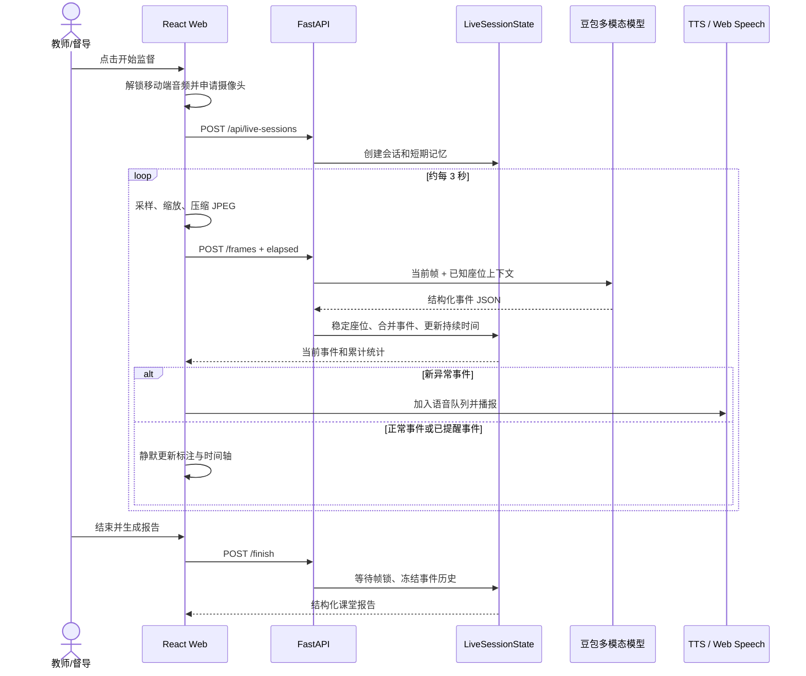
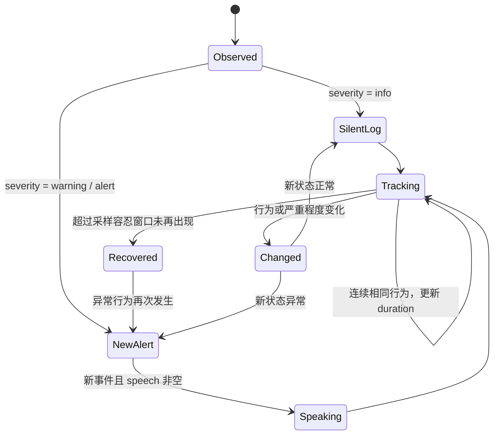

# AI Digital Teacher Agent 架构设计

本文说明项目为什么被设计为一个垂直 AI Agent、一次实时课堂会话如何运行，以及实现中对连续性、提醒策略、故障降级和隐私边界的处理。

## 1. 任务定义

系统要解决的并不是“识别一张图片里有什么”，而是持续回答四个问题：

1. 当前画面里有哪些清晰可见的学生，他们位于什么座位？
2. 每名学生当前最主要的、可观察的课堂行为是什么？
3. 这个行为是正常学习状态，还是需要提醒的异常状态？
4. 新结果与前几次观察是什么关系，是否需要立即采取行动？

因此，系统采用“模型负责感知和语义理解，确定性程序负责状态和行动策略”的混合架构。模型不直接控制浏览器，也不自行决定是否重复播报；它输出经过约束的结构化事件，由会话状态机继续处理。

## 2. Agent 边界

### Agent 能做什么

- 接收摄像头帧并识别画面内可见的课堂行为；
- 根据历史座位表保持学生位置标签相对稳定；
- 合并连续相同状态，记录开始时间和持续时间；
- 根据严重程度决定静默记录或进入语音提醒队列；
- 在单帧失败后继续下一轮观察；
- 结束会话时根据完整事件历史生成报告。

### Agent 明确不做什么

- 不做人脸识别，不推断姓名、身份或敏感属性；
- 不诊断情绪、疾病、性格或行为动机；
- 不独立做处分、成绩评定等高影响决策；
- 不把模型置信度包装成已验证的教学质量结论；
- 不在前端保存或暴露云服务密钥。

## 3. 一次会话的运行时序



## 4. 感知层

前端通过 `getUserMedia` 获取视频流：

- 桌面设备优先使用默认摄像头；
- 移动设备优先请求 `environment`，即后置摄像头；
- 用户仍可在多个摄像头之间切换；
- 音频输入始终关闭，系统不会采集麦克风；
- 视频帧会缩放到适合模型分析的尺寸并压缩为 JPEG，再以 multipart 表单提交。

系统采用间隔采样而不是上传完整视频流，以控制延迟、带宽和推理成本。页面会明确展示分析间隔和当前分析状态。

## 5. 推理层

`DoubaoVideoAnalysisProvider` 把以下上下文发送给模型：

- 当前画面；
- 当前会话经过确认的座位表；
- 采样发生的课堂相对时间；
- 严格的课堂行为判定和 JSON 输出约束。

模型返回：

```json
{
  "classroom_summary": "当前课堂画面的客观说明",
  "events": [
    {
      "id": "frame-event-001",
      "time": 12,
      "duration": 3,
      "students": [
        {
          "id": "r1-s1",
          "label": "第一排第一位",
          "rect": { "x": 0.1, "y": 0.2, "width": 0.2, "height": 0.5 }
        }
      ],
      "behavior": "使用手机",
      "speech": "第一排第一位同学，请收起手机，专注学习。",
      "severity": "warning"
    }
  ]
}
```

后端不会直接信任这段输出。它会提取 JSON、限制字符串长度、校正坐标边界、过滤超出课堂时间的事件，并用 Pydantic 再次验证类型。

## 6. 短期记忆与身份连续性

`LiveSessionState` 是当前 Agent 的工作记忆，保存：

- `known_students`：已经建立的稳定座位；
- `active_by_student`：每个座位当前处于哪个事件；
- `last_seen_sample`：座位上次出现在哪次采样；
- `events`：课堂开始以来的完整事件；
- `sample_count` 与 `latest_summary`：会话统计和最新上下文。

系统只做位置连续性：

1. 优先复用模型返回且已存在的 student id；
2. 否则计算当前检测框中心与历史座位中心的距离；
3. 距离足够近时沿用历史座位 id 和 label；
4. 无可靠匹配时创建新的座位 id。

这种设计不会确认现实身份，但足以在固定课堂机位下维持“第一排第一位”一类观察对象的连续记录。

## 7. 事件合并与提醒策略

同一座位在相邻采样中保持相同 `behavior + severity` 时，会继续更新原事件的持续时间，而不是每 3 秒创建一个重复事件。



前端只把“新出现且未播报过的异常事件”加入语音队列。云端 TTS 失败时自动尝试浏览器语音；若移动浏览器仍阻止自动播放，则展示“播放当前提醒”按钮，让用户通过一次手势完成播报。

## 8. 并发与故障处理

- 每个会话拥有 `asyncio.Lock`，避免同一课堂的两帧同时改写状态；
- 结束课堂会等待正在分析的最后一帧，避免报告与写入竞争；
- 单帧模型超时或返回错误时，接口返回 `degraded` 而不是终止整场课堂；
- 下一次采样会自动继续，已经积累的事件不会丢失；
- TTS 与视觉分析使用独立 Provider，语音故障不会阻断视觉事件记录；
- 浏览器摄像头关闭或切换时，前端会清理定时器和媒体轨道。

## 9. 报告与持久化

课堂结束后，后端根据已校验事件生成结构化报告，包括课堂总结、学生维度统计、提醒次数和时间轴。报告生成使用确定性本地规则，不会再次调用大模型，因此同一事件输入能够得到稳定结果。

当前线上版本的边界：

- 实时会话保存在 Render 单实例内存中，服务重启后失效；
- 最近 30 份完成报告保存在浏览器 LocalStorage；
- 没有账号体系、云端数据库和跨设备同步；
- 上传的教师图片由当前媒体 Provider 处理，免费实例的本地文件不保证长期保留。

## 10. 为什么采用混合 Agent

| 方案 | 优点 | 问题 | 本项目选择 |
| --- | --- | --- | --- |
| 全规则视觉 | 结果稳定 | 很难覆盖开放场景语义 | 不采用 |
| 模型直接控制全部流程 | 开发快 | 状态不可控、容易重复行动 | 不采用 |
| 模型感知 + 程序状态机 | 兼顾语义能力与工程可控性 | 需要设计结构化协议和状态逻辑 | 采用 |

这套边界把最适合模型的“画面理解”与最适合程序的“事件一致性、提醒频率和数据校验”分开，也让测试、降级和审计更容易。

## 11. 可评测方向

下一阶段可建立经人工标注的课堂片段集，分别评估：

- 学生检测召回率与框位置 IoU；
- 正常/异常行为的精确率、召回率和混淆矩阵；
- 跨帧座位 id 稳定率；
- 重复提醒率与应提醒未提醒率；
- 单帧端到端延迟及不同网络下的可用性；
- 教师对提醒准确性、打扰程度和报告可读性的主观评分。

这些指标比展示单一“AI 准确率”更能反映一个课堂观察 Agent 是否真正可用。
